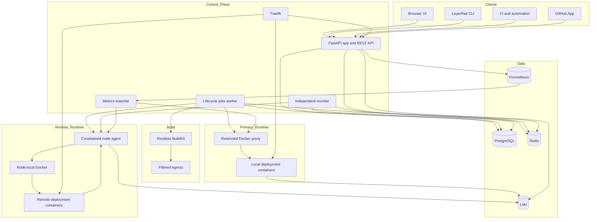

# LayerRail architecture

LayerRail is a control plane around Git, isolated builds, constrained Docker runtimes, durable state, and central routing. The browser UI, REST API, CLI, webhooks, and GitHub events all converge on the same deployment scheduling module rather than implementing separate lifecycle paths.

## System map

## Deep modules and seams

### Deployment scheduling

`DeploymentService.schedule()` is the admission seam for browser, API, and GitHub work. It resolves the environment, acquires an environment Redis lock, deduplicates webhook deliveries, applies explicit concurrency policy, selects a runtime node, snapshots project state, enqueues one deterministic job, audits the action, and emits notifications. Newest-commit-wins cleanup happens only after the replacement is safely queued.

`DeploymentPolicyService` owns branch globs, ignored authors, skip-message tokens, automatic webhook enablement, concurrent admission, and supersession. Projects without an explicit policy retain legacy behavior; saving policy creates the explicit contract.

### Config as code

`ProjectConfigService` owns the public `.layerrail.json` schema. The jobs worker reads the file from the exact immutable commit after obtaining its GitHub installation token and before selecting build strategy, commands, resources, or cache behavior. Secrets and environment variable values are not accepted. `devpush.json` remains a temporary compatibility filename.

### Build isolation

Dockerfile source is downloaded at an immutable commit, bounded by compressed size, extracted size, file count, path containment, and Dockerfile size, then sent over a group-restricted Unix socket to rootless BuildKit. BuildKit has one internal network, no host socket, a read-only root filesystem, resource ceilings, persistent bounded cache, and no control-plane route. Public dependency traffic must cross a capability-dropped proxy that denies private, loopback, link-local, metadata, and reserved destinations.

A completed image is exported with a hard size ceiling. Local deployments load it through the restricted Docker endpoint. Remote deployments stream it to the selected agent; the agent verifies the managed image name, deployment ownership label, command, non-root user, and archive bound before use.

### Runtime adapters

Lifecycle workers use one Docker-shaped seam. The local adapter is `aiodocker` through a restrictive proxy. `NodeDockerClient` translates the same worker calls into the authenticated node protocol. Agent-reported hosts are ignored: runtime URLs are reconstructed from enrolled host/scheme metadata and a validated bounded port.

The node agent is not a Docker proxy. It exposes only health, approved image operations, managed runtime create/start/inspect/log/stop/delete, inventory, and metrics. It validates IDs, names, environment size, commands, paths, capabilities, cache namespaces, image prefixes, ownership labels, capacity, and ports. Its Compose topology initializes cache ownership, then runs non-root, read-only, capability-dropped, no-new-privileges, and resource-bounded.

Local SQLite and volume mounts pin an environment to the primary runtime. S3-compatible object and Cloudinary media connections have no host path and remain remotely eligible.

### Routing

Traefik combines Docker discovery for primary containers with generated file-provider services for remote runtimes. Every deployment has an immutable hostname. Successful finalization updates branch, environment, and environment-ID aliases under the same environment lock. Custom domains map to environment aliases. Redirect domain types emit Traefik `redirectRegex` middleware with the configured permanent/temporary semantics.

### Logs, diagnostics, and metrics

Deployment output is shipped to Loki and streamed through authenticated SSE. Final container output is preserved directly when short-lived containers disappear before Alloy discovery. Worker/control-plane failures are separately recorded as structured PostgreSQL diagnostics, so the UI remains useful if Loki is unavailable.

Lifecycle jobs heartbeat in PostgreSQL. The independent monitor compares stale leases with deterministic queue state before replaying or failing work; elapsed build time alone never declares a Dockerfile job dead.

The internal metrics exporter reads only labeled containers through the restricted proxy and authenticated node endpoints. Prometheus stores bounded history. Canonical `layerrail_*` metrics and temporary `devpush_*` compatibility series are emitted together.

### API and CLI

`ApiTokenService` returns a raw `lr_live_*` or `lr_test_*` token once and stores only its SHA-256 digest, team, scopes, expiry, creator, revocation, and coarse last-use timestamp. `get_api_principal()` authenticates bearer tokens, enforces team scope, and applies an atomic Redis rate limit. Browser sessions never authenticate REST mutations. API project creation additionally proves that the token creator can access the repository and that the supplied GitHub App installation is the installation GitHub reports for that repository.

The `/api/v1` router exposes project CRUD/config/export, deployment create/list/status/cancel/logs/rollback, audit history, and webhook management. The dependency-free Python CLI is a thin adapter over that interface and stores credentials in the platform config directory with owner-only permissions on POSIX.

### Governance and notifications

`AuditService` records actor, token, resource, request origin, and bounded metadata. Secret-like keys are recursively redacted before persistence.

`NotificationService` validates production webhook targets as public HTTPS destinations and connects to the validated address while retaining the original Host header and TLS SNI, closing DNS-rebinding races. Events create durable `WebhookDelivery` rows before queue admission; the independent monitor reconciles pending rows after queue outages. Jobs sign canonical JSON with HMAC-SHA256, do not follow redirects, keep response status/error class only, and retry three times. Email preferences can notify explicit recipients or team owners/admins on selected terminal deployment states.

### Rate limits and browser security

`RateLimiter` uses one atomic Redis script to increment and set window expiry. Magic-link issuance is keyed by client address plus email. General API and deployment-create limits are keyed by token. Browser responses include a same-origin content policy, no-sniff, frame denial, strict referrer policy, restricted browser features, and HSTS in production.

## Data ownership

- PostgreSQL is authoritative for users, teams, projects, deployments, API tokens, audit events, webhook deliveries, node enrollment, domains, diagnostics, and resource metadata.
- Redis carries deterministic jobs, locks, rate-limit windows, and transient status streams.
- Loki stores application output; PostgreSQL stores critical control-plane diagnostics.
- Prometheus stores bounded resource history.
- Host storage paths are generated below the configured data root; users configure container paths only.
- Remote buckets and Cloudinary assets are customer-owned. Disconnecting LayerRail metadata never deletes them.

## Compatibility

LayerRail keeps internal Compose project/network names, `devpush.*` Docker labels, migration history, deterministic queue names, and old data paths where changing them would make upgrades destructive. Public runtime contracts are canonicalized to `LAYERRAIL_*`; matching `DEVPUSH_*` aliases remain. New JWTs use `layerrail-app`/`layerrail-web`, while configured legacy issuers and audiences remain accepted until old sessions expire.

## Repository structure

- `app/routers` — browser, GitHub, event, admin, and versioned REST interfaces.
- `app/services` — deep modules for scheduling, policy, auth tokens, audit, notifications, config, builds, storage, nodes, logs, and metrics.
- `app/workers` — deterministic lifecycle and maintenance jobs plus independent reconciliation.
- `app/migrations` — reversible PostgreSQL schema evolution.
- `app/templates` and `app/src` — HTMX/Alpine UI, Tailwind source, and email source.
- `cli` — official dependency-free CLI package.
- `node_agent` — constrained remote runtime implementation.
- `compose` and `docker` — production topology and security policy.
- `registry` — versioned runners and framework presets.
- `scripts` — installation, update, backup, restore, migration, and isolation workflows.

## Release invariants

A release is not complete until unit tests, CLI tests, template parsing, lock checks, migration upgrade/downgrade/fresh parity, development/production/node Compose rendering, production image builds, node-agent tests, BuildKit isolation, browser smoke tests, API E2E, secret scanning, and residue cleanup all pass.
