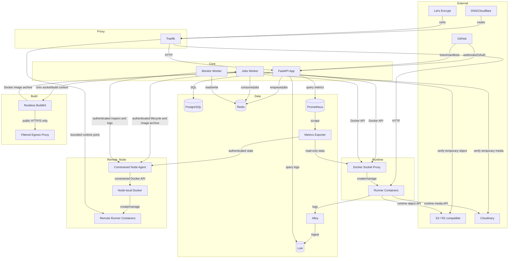
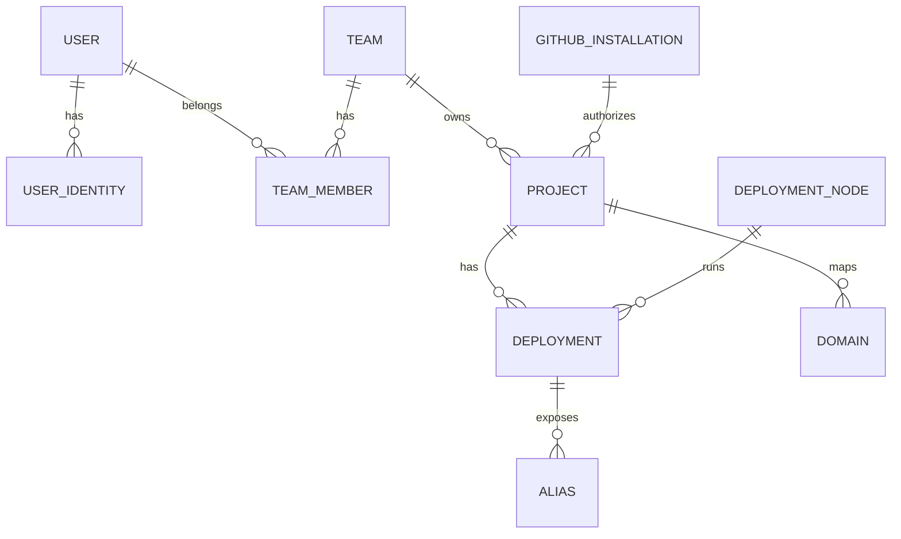

# Architecture

This document describes the high‑level architecture of /dev/push, how the main services interact, and the end‑to‑end deployment flow. It reflects the current implementation in this repo.

## Stack

- Docker & [Docker Compose](https://github.com/docker/compose)
- Rootless [BuildKit](https://github.com/moby/buildkit)
- [Traefik](https://github.com/traefik/traefik)
- [Loki](https://github.com/grafana/loki)
- [Alloy](https://github.com/grafana/alloy)
- [Prometheus](https://prometheus.io/)
- [PostgreSQL](https://www.postgresql.org/)
- [Redis](https://redis.io/)
- [FastAPI](https://fastapi.tiangolo.com/)
- [arq](https://arq-docs.helpmanual.io/)
- [HTMX](https://htmx.org)
- [Alpine.js](https://alpinejs.dev/)
- [Basecoat](https://basecoatui.com)

## Overview

- **App**: The app handles all of the user-facing logic (managing teams/projects, authenticating, searching logs...). It communicates with the workers via Redis.
- **Workers**: Scheduling is serialized by project environment before an arq job is created. Webhook deliveries are idempotent and newest-commit-wins: older webhook jobs in `prepare` or `deploy` become skipped and are aborted/cleaned, while manual deploys are never superseded. Lifecycle tasks maintain a database heartbeat. The independent monitor compares stale leases with deterministic ARQ job state and directly recovers abandoned prepare/fail/finalize work. The finalizer promotes aliases under the same environment lock. Deployment lifecycle statuses: `prepare → deploy → finalize → completed` (with `conclusion`: succeeded/failed/canceled/skipped; `fail` is transient for failure handling).
- **Logs**: build and runtime logs are streamed from Loki and served to the user via an SSE endpoint in the app.
- **Metrics**: An internal exporter converts read-only Docker stats for labeled deployment containers into Prometheus metrics. The authenticated app queries Prometheus and renders project resource charts; neither backend is publicly routed.
- **Runners**: Zero-config apps run inside language containers pulled from the registry catalog. Dockerfile apps are built into immutable per-deployment images and run their image-defined command.
- **Dependency cache**: Official zero-config runners direct package-manager caches to `/cache`. DevPush mounts a host-backed generation isolated by project, environment, and runner image. Cache clears rotate generations atomically; background pruning removes only generations no longer mounted by current, rollback, or stopped containers.
- **Persistent storage**: Team-owned SQLite databases and volume directories connect to selected project environments. `StorageService` validates container paths, prevents overlapping mounts, resolves deterministic host paths, and blocks destructive actions while any retained container references a resource.
- **Object storage**: Team-owned S3/R2-compatible connections store only non-secret provider metadata in JSON; Fernet-encrypted credentials are decrypted by the jobs worker and injected into selected runtime environments after all build work completes.
- **Media providers**: Team-owned Cloudinary connections verify temporary upload/read/delete access, encrypt API credentials, and inject namespaced media configuration only when selected runtime containers are created.
- **Remote deployment nodes**: Superadmins enroll authenticated constrained agents. Eligible deployments are assigned to the least-loaded healthy active node; local SQLite/volume attachments pin placement to the primary host. Central Traefik, monitoring, and metrics continue to span every node.
- **BuildKit**: Only the jobs worker can reach the rootless daemon over a group-restricted Unix socket. BuildKit has persistent layer cache, a private internal network, a read-only root filesystem, bounded resources, and no host Docker socket or control-plane network membership. Public dependency traffic crosses a separate filtered-egress proxy.
- **Framework detection**: Repository import reads one recursive Git tree and a bounded batch of manifests. The detector ranks every candidate application root, derives package-manager-aware commands, and returns a recommendation plus monorepo alternatives and evidence. Explicit Dockerfiles are associated with their application roots and take precedence while remaining editable.
- **Reverse proxy**: We have Traefik sitting in front of both app and the deployed runner containers. All routing is done using Traefik labels, and we also maintain environment and branch aliases (e.g. `my-project-env-staging.devpush.app`) using Traefik config files.

## File structure

- `app/`: The main FastAPI application (see README file).
- `app/workers`: The workers (`jobs` and `monitor`)
- `docker/`: Container definitions and entrypoint scripts for the app/workers and local development.
- `node_agent/`: Authenticated, constrained Docker lifecycle protocol for remote deployment hosts.
- `scripts/`: Helper scripts for local (macOS) and production environments
- `compose/`: Container orchestration with Docker Compose. The central stack uses `base.yml` plus an environment override; `node-agent.yml` installs a standalone remote node.

Operational script notes:
- `start.sh`, `stop.sh`, and `restart.sh` support component-scoped operations via `--components <csv>`.
- `update.sh` defaults to updating `app` only; use `--all`, `--components`, `--full`, or `scripts/upgrades/*.json` metadata to widen update scope.

## System Diagram

Notes:

- Runner containers write logs locally; Alloy tails those files and ships them to Loki. The app queries Loki to stream build/runtime logs to clients (SSE).
- Traefik routes both the app and user deployments. Dynamic file configuration is generated for aliases and custom domains.

## Components

### App (FastAPI)

- Web app and webhook API, allowing users to login and manage teams/projects/deployments.
- Processes GitHub webhooks; creates deployments; serves SSE for project updates and deployment logs.
- Files: `app/main.py`, `app/routers/*`, `app/services/*`, `app/models.py`.

### Workers

#### Jobs

- Background jobs for deployments and cleanup.
- Jobs: `start_deployment`, `finalize_deployment`, `fail_deployment`, `delete_container`, `delete_*`.
- Files: `app/workers/jobs.py`, `app/workers/tasks/deployment.py`, `app/workers/tasks/project.py`, `app/workers/tasks/team.py`, `app/workers/tasks/user.py`.

#### Monitor

- Polls running deployments every ~2s, probes port 8000 over `devpush_runner` network.
- On success enqueues `finalize_deployment`; on failure enqueues `fail_deployment`; cancellations enqueue `delete_container` to clean up runners after a grace.
- File: `app/workers/monitor.py`.

### Traefik

- Reverse proxy with Docker and file providers; TLS via ACME.
- Routes: app (`APP_HOSTNAME`) and deployments (by Docker labels and dynamic file for aliases/domains).
- Catch-all router: `deployment-not-found` redirects unknown deployment subdomains to a "deployment not found" page.
- Certificate challenge provider selection: Determines which `ssl-*.yml` compose file is loaded; configured via `CERT_CHALLENGE_PROVIDER` in `.env`.

### Docker Socket Proxy

- `tecnativa/docker-socket-proxy` exposing an endpoint allowlist used by workers, Traefik, and Alloy.
- Host `/build`, `/exec`, volume, and system-management endpoints are denied. The worker may load a completed BuildKit image but cannot invoke the host Docker builder.

### Remote Deployment Nodes

- `DeploymentNodeService` owns endpoint policy, enrollment verification, token encryption, health, capacity-aware placement, drain/activation, target generation, runtime-address validation, and deletion safety.
- The node agent is the only service on a remote host that mounts its local Docker socket. Its bearer-authenticated protocol exposes only approved image, container, log, health, and metric operations; it is not a general Docker API tunnel.
- The standalone Compose stack initializes the cache bind mount with the configured UID/GID, then runs the agent non-root with a read-only filesystem, no capabilities, no-new-privileges, and bounded CPU, memory, and PIDs.
- `DOCKER_GID` must match the remote host Docker socket group; it grants the otherwise unprivileged agent access only to its node-local socket.
- Central workers use a Docker-compatible adapter so local and remote lifecycle code share one contract. Remote origins are reconstructed and checked against the enrolled host and bounded port range before Traefik configuration is written.
- Zero-config dependency caches live on the selected node. Dockerfile archives are exported by central rootless BuildKit and streamed to the agent with a hard size limit; loaded images must carry the expected deployment ownership label and pass runtime-image policy.
- The monitor refreshes node health, probes remote runtimes, and synchronizes logs. The metrics exporter federates authenticated node metrics and attaches `node_id` to every remote series.
- Draining prevents new placement without stopping retained containers. Node deletion requires both the database and live agent inventory to be empty and fails closed when the node cannot be verified.

### Rootless BuildKit

- `buildkitd` runs as UID/GID 1000 with the native snapshotter, sandbox process mode, a read-only root filesystem, CPU/memory/PID limits, and bounded persistent cache state. The build client also enforces the configured image-export maximum with an OS file-size limit.
- A one-shot permission gate exposes only its Unix socket to the jobs worker. The app and monitor do not receive the socket and no service mounts the host Docker socket except the policy proxy.
- Build steps have no direct route off their fixed private network. A Squid adapter with a static private address and a separate egress network permits public ports 80/443 and denies loopback, private, link-local, metadata, benchmark, documentation, multicast, and reserved address ranges.
- Build contexts come from immutable GitHub archives. Archive path, file-count, compressed-size, extracted-size, Dockerfile-size, build-time, and image-size limits are enforced by `DockerfileBuilder`.
- GitHub installation credentials stay in the jobs worker. Project environment variables are not passed to Dockerfile builds.

### PostgreSQL

- Primary datastore (users, teams, projects, deployments, aliases, domains, GitHub installations).
- `deployment_diagnostic` stores redacted control-plane events independently from Loki; deployment rows carry the current worker job, phase, attempt, and heartbeat.

### Redis

- ARQ job queue and Redis Streams for real‑time updates to the UI.

### Persistent Storage

- `storage` owns the resource lifecycle; `storage_project` records the project, selected environments, and container mount directory.
- Provisioning creates only deterministic paths below `/data/storage/<team>/<type>/<name>`; users never provide a host path.
- SQLite files use WAL mode. Volume and database roots inherit the service group; deployment containers receive that supplemental group for non-root access.
- Active attachments are resolved and row-locked immediately before container creation. Containers carry `devpush.storage_ids` labels for independent mount-use detection.
- Reset and delete acquire the storage row, inspect all scoped Docker containers, and fail closed on Docker errors or any current/rollback/stopped mount.
- Provision/reset/delete jobs are transition-specific and deterministic. The monitor scans pending/resetting/deleted rows without holding an idle transaction and recovers a transition if its original request died before enqueueing.
- Object connections have no host path. Provisioning validates DNS/HTTPS policy, verifies bucket read/write/delete with a temporary object, and marks the connection active without creating or deleting remote buckets.
- Runtime object variables use collision-checked `DEVPUSH_OBJECT_<NAME>_*` namespaces. A single connection also receives conventional AWS SDK aliases. Credential rotation is verified before one row-locked encrypted update; existing containers retain their prior snapshot.
- Media connections have no host path. Provisioning uses Cloudinary Basic authentication to upload a tiny unique image, read its metadata, and delete it before activation. Production is restricted to official regional API endpoints.
- Runtime media variables use collision-checked `DEVPUSH_MEDIA_<NAME>_*` namespaces. A single connection also receives `CLOUDINARY_URL` and conventional Cloudinary aliases. Rotation is verified before one row-locked encrypted update; existing containers retain their prior snapshot and connection deletion never deletes remote assets.

### Loki

- Centralized logs for deployments (build/runtime). Queried by the app for streaming.

### Metrics Exporter

- Lists only scoped Docker containers, keeps running deployment labels, and converts one-shot Docker stats into cumulative counters and gauges.
- Runs non-root with a read-only filesystem, no host Docker socket, no public route, and bounded CPU, memory, PIDs, concurrency, and request timeouts.

### Prometheus

- Scrapes the exporter every five seconds and retains at most seven days or 2 GB by default.
- Persists its TSDB in `prometheus-data`; only the authenticated app queries it for deployment charts.

## Deployment Flow

1) Trigger
  - Webhook: GitHub -> `/api/github/webhook` (verify signature and delivery ID, resolve project) -> lock the environment -> deduplicate the delivery -> create/enqueue the replacement -> mark older active webhook deployments skipped -> abort and clean them. Partial scheduling failures return `500`; GitHub redelivery safely reuses completed scheduling work.
  - Manual: user selects commit/env -> lock the environment -> create DB record -> enqueue `start_deployment`. Manual work does not participate in webhook supersession.

1a) Placement
  - Local SQLite or volume attachments pin the environment to the primary host.
  - Otherwise select the least-loaded healthy active node below its configured capacity. Automatic placement uses the primary host when no remote node is eligible.
  - Persist the node assignment before enqueueing so every lifecycle, cancellation, cleanup, route, log, and metric operation addresses the same runtime.

2) `start_deployment`
  - Zero-config: ensure the language image exists on the selected runtime, create a runner, clone the selected commit, run optional build/pre-deploy commands, then start the app.
  - For cache-aware zero-config runners, mount the selected dependency-cache generation at `/cache`, emit hit/miss metadata, and mark it reusable only after the build command succeeds.
  - Dockerfile: download the immutable GitHub archive, safely extract the selected root, stream the context to rootless BuildKit, then load the ownership-labeled managed image into the selected local or remote runtime and start its `CMD`/`ENTRYPOINT` without source credentials.
  - Apply runtime env vars, resource limits, Traefik labels, and JSON logging to either container type.
  - Resolve active storage for the selected environment, lock its rows through container creation, attach validated bind mounts, and label every storage ID.
  - Mark deployment `in_progress`, set `container_id=…`, emit Redis Stream update.

3) Monitor
  - Probe a local container on `devpush_runner:8000/` or the validated enrolled node runtime URL.
  - On ready -> enqueue `finalize_deployment`. On exit/error -> enqueue `fail_deployment`.

4) Finalize:
  a) finalize_deployment (success)
    - Acquire the environment scheduling lock and leave aliases unchanged if a newer deployment already succeeded.
    - Mark `status=completed`, `conclusion=succeeded`.
    - Create/update aliases: branch, environment, environment_id.
    - Regenerate Traefik dynamic config for aliases and custom domains.
    - Enqueue `cleanup_inactive_containers` and emit Redis Stream updates.

  b) fail_deployment (error)
    - Stop/remove container if present; mark `conclusion=failed` and emit updates.

## Data Model (Simplified)

Notes:

- Project env vars and OAuth tokens are encrypted at rest (Fernet).
- Deployment captures a snapshot of project config/env at creation time.
- Aliases track current and previous deployment to support instant rollback.

## Networking

- `devpush_default`: public (Traefik, app, Loki).
- `devpush_internal`: internal (DB, Redis, Docker proxy, Traefik file provider).
- `devpush_runner`: runner network for deployed containers; Traefik and workers attach to route/probe.
- Remote nodes expose only their authenticated control endpoint and configured runtime port range. Central Traefik must resolve the enrolled runtime host; node-local Docker remains unexposed.
- `${DEVPUSH_VOLUME_PREFIX}_buildkit`: internal BuildKit/build-step network with no default egress route. It is not shared with app, database, Redis, Docker proxy, or runners.
- `${DEVPUSH_VOLUME_PREFIX}_buildkit-egress`: outbound network used only by the filtered proxy.
- Prometheus and `metrics-exporter` join only `devpush_internal`; neither has a host port or Traefik route.

## Observability

- Logs: runner containers -> Loki; app queries `Loki /loki/api/v1/query_range` and streams via SSE.
- Durable diagnostics: workers/watchdog -> PostgreSQL; the app merges these events into deployment and project log views even when Loki is unavailable.
- Recovery: active prepare/fail/finalize jobs heartbeat in PostgreSQL. The monitor confirms stale leases against ARQ state before failing or replaying lifecycle work.
- Metrics: runner Docker stats -> internal exporter -> Prometheus -> authenticated project Monitoring dashboard.
- Status: Redis Streams power SSE for project and deployment updates.
- Health: app `/health`; ARQ `--check`; Docker Compose healthchecks for services.
- Node health: the monitor verifies authenticated agent protocol, Docker availability, cache writeability, capacity metadata, and enrolled runtime identity.

## Security

- Sessions: signed cookies with CSRF protection (no Redis session storage).
- Secrets: Fernet encryption for env vars and tokens.
- Dependency caches: Build-controlled cache contents are isolated by project/environment/runner and never mounted into Dockerfile builds or another project. Clearing rotates paths instead of deleting mounts used by running containers.
- Persistent storage: host paths are deterministic and identity-validated; only container paths are configurable. Overlapping paths are rejected, platform directories are reserved, and destructive operations fail closed while a labeled or legacy mount exists.
- Object storage: production custom endpoints require HTTPS and public DNS results. Credentials remain encrypted at rest, are never logged or exposed to build steps, and connection deletion removes only DevPush metadata—never remote objects.
- Media providers: Cloudinary API keys and secrets remain encrypted at rest, are injected only at runtime, and are never logged or exposed to build steps. Production accepts only official regional endpoints; disconnecting removes only DevPush metadata and never customer media.
- Docker: host build/exec/system endpoints are denied by the proxy; repository build steps execute in rootless BuildKit without the host socket. Runtime containers drop all capabilities, cannot gain privileges, and have a PID ceiling. Dockerfile images must declare a non-root user and receive no capabilities; zero-config runner bootstraps receive only the ownership and UID/GID capabilities needed to become the configured non-root user.
- Source: Dockerfile archives are bounded and extracted with Python's data filter plus explicit path/size checks.
- Build secrets: GitHub and project secrets are not exposed to Dockerfile instructions or persisted in build context/cache.
- Egress: builds can fetch public dependencies but cannot connect directly or through the proxy to control-plane/private, host, or cloud-metadata ranges.
- Metrics: the exporter has no Docker socket and receives only scoped container lists plus read-only one-shot stats from the policy proxy; Prometheus and exporter endpoints remain internal.
- Remote nodes: bearer tokens are encrypted in PostgreSQL and written only to a mode-`0600` internal target file. Production control endpoints require HTTPS and public DNS by default; private or insecure endpoints require separate operator opt-ins. Agent-reported runtime origins are never trusted without enrolled host, scheme, and port validation.

## Scaling

- App and workers can scale horizontally behind Traefik; remote runtime capacity scales by enrolling and activating additional nodes.
- DB and Redis can be sized independently; cleanup tasks keep unused containers down.

## Implementation Notes

- Traefik dynamic config for aliases/domains is written to `TRAEFIK_DIR` per project (`DeploymentService.update_traefik_config`).
- Runner images are language‑specific (e.g., Python, Node). Selection and commands come from project config.
- SSE endpoints: `app/routers/event.py` for project updates and deployment logs.
