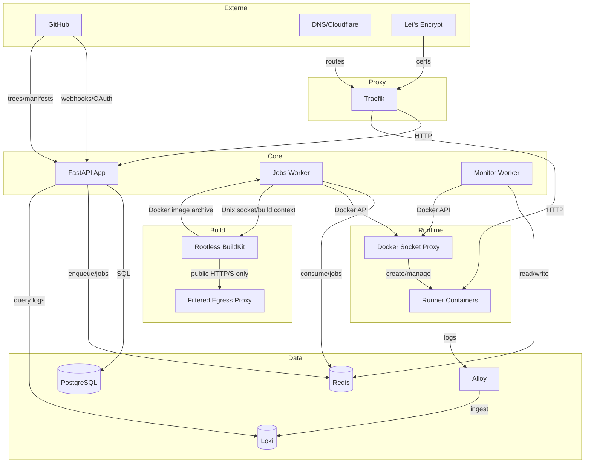
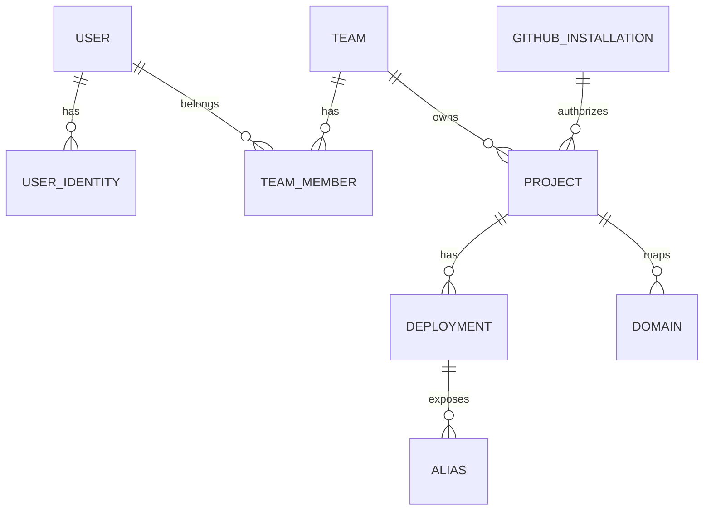

# Architecture

This document describes the high‑level architecture of /dev/push, how the main services interact, and the end‑to‑end deployment flow. It reflects the current implementation in this repo.

## Stack

- Docker & [Docker Compose](https://github.com/docker/compose)
- Rootless [BuildKit](https://github.com/moby/buildkit)
- [Traefik](https://github.com/traefik/traefik)
- [Loki](https://github.com/grafana/loki)
- [Alloy](https://github.com/grafana/alloy)
- [PostgreSQL](https://www.postgresql.org/)
- [Redis](https://redis.io/)
- [FastAPI](https://fastapi.tiangolo.com/)
- [arq](https://arq-docs.helpmanual.io/)
- [HTMX](https://htmx.org)
- [Alpine.js](https://alpinejs.dev/)
- [Basecoat](https://basecoatui.com)

## Overview

- **App**: The app handles all of the user-facing logic (managing teams/projects, authenticating, searching logs...). It communicates with the workers via Redis.
- **Workers**: Scheduling is serialized by project environment before an arq job is created. Webhook deliveries are idempotent and newest-commit-wins: older webhook jobs in `prepare` or `deploy` become skipped and are aborted/cleaned, while manual deploys are never superseded. The jobs worker starts a container, the monitor worker probes readiness, and the finalizer promotes aliases under the same environment lock. Deployment lifecycle statuses: `prepare → deploy → finalize → completed` (with `conclusion`: succeeded/failed/canceled/skipped; `fail` is transient for failure handling).
- **Logs**: build and runtime logs are streamed from Loki and served to the user via an SSE endpoint in the app.
- **Runners**: Zero-config apps run inside language containers pulled from the registry catalog. Dockerfile apps are built into immutable per-deployment images and run their image-defined command.
- **BuildKit**: Only the jobs worker can reach the rootless daemon over a group-restricted Unix socket. BuildKit has persistent layer cache, a private internal network, a read-only root filesystem, bounded resources, and no host Docker socket or control-plane network membership. Public dependency traffic crosses a separate filtered-egress proxy.
- **Framework detection**: Repository import reads one recursive Git tree and a bounded batch of manifests. The detector ranks every candidate application root, derives package-manager-aware commands, and returns a recommendation plus monorepo alternatives and evidence. Explicit Dockerfiles are associated with their application roots and take precedence while remaining editable.
- **Reverse proxy**: We have Traefik sitting in front of both app and the deployed runner containers. All routing is done using Traefik labels, and we also maintain environment and branch aliases (e.g. `my-project-env-staging.devpush.app`) using Traefik config files.

## File structure

- `app/`: The main FastAPI application (see README file).
- `app/workers`: The workers (`jobs` and `monitor`)
- `docker/`: Container definitions and entrypoint scripts for the app/workers and local development.
- `scripts/`: Helper scripts for local (macOS) and production environments
- `compose/`: Container orchestration with Docker Compose. Files: `base.yml`, `override.yml`, `override.dev.yml`, and SSL provider-specific files (`ssl-default.yml`, `ssl-cloudflare.yml`, etc.).

Operational script notes:
- `start.sh`, `stop.sh`, and `restart.sh` support component-scoped operations via `--components <csv>`.
- `update.sh` defaults to updating `app` only; use `--all`, `--components`, `--full`, or `scripts/upgrades/*.json` metadata to widen update scope.

## System Diagram

Notes:

- Runner containers write logs locally; Alloy tails those files and ships them to Loki. The app queries Loki to stream build/runtime logs to clients (SSE).
- Traefik routes both the app and user deployments. Dynamic file configuration is generated for aliases and custom domains.

## Components

### App (FastAPI)

- Web app and webhook API, allowing users to login and manage teams/projects/deployments.
- Processes GitHub webhooks; creates deployments; serves SSE for project updates and deployment logs.
- Files: `app/main.py`, `app/routers/*`, `app/services/*`, `app/models.py`.

### Workers

#### Jobs

- Background jobs for deployments and cleanup.
- Jobs: `start_deployment`, `finalize_deployment`, `fail_deployment`, `delete_container`, `delete_*`.
- Files: `app/workers/jobs.py`, `app/workers/tasks/deployment.py`, `app/workers/tasks/project.py`, `app/workers/tasks/team.py`, `app/workers/tasks/user.py`.

#### Monitor

- Polls running deployments every ~2s, probes port 8000 over `devpush_runner` network.
- On success enqueues `finalize_deployment`; on failure enqueues `fail_deployment`; cancellations enqueue `delete_container` to clean up runners after a grace.
- File: `app/workers/monitor.py`.

### Traefik

- Reverse proxy with Docker and file providers; TLS via ACME.
- Routes: app (`APP_HOSTNAME`) and deployments (by Docker labels and dynamic file for aliases/domains).
- Catch-all router: `deployment-not-found` redirects unknown deployment subdomains to a "deployment not found" page.
- Certificate challenge provider selection: Determines which `ssl-*.yml` compose file is loaded; configured via `CERT_CHALLENGE_PROVIDER` in `.env`.

### Docker Socket Proxy

- `tecnativa/docker-socket-proxy` exposing an endpoint allowlist used by workers, Traefik, and Alloy.
- Host `/build`, `/exec`, volume, and system-management endpoints are denied. The worker may load a completed BuildKit image but cannot invoke the host Docker builder.

### Rootless BuildKit

- `buildkitd` runs as UID/GID 1000 with the native snapshotter, sandbox process mode, a read-only root filesystem, CPU/memory/PID limits, and bounded persistent cache state. The build client also enforces the configured image-export maximum with an OS file-size limit.
- A one-shot permission gate exposes only its Unix socket to the jobs worker. The app and monitor do not receive the socket and no service mounts the host Docker socket except the policy proxy.
- Build steps have no direct route off their fixed private network. A Squid adapter with a static private address and a separate egress network permits public ports 80/443 and denies loopback, private, link-local, metadata, benchmark, documentation, multicast, and reserved address ranges.
- Build contexts come from immutable GitHub archives. Archive path, file-count, compressed-size, extracted-size, Dockerfile-size, build-time, and image-size limits are enforced by `DockerfileBuilder`.
- GitHub installation credentials stay in the jobs worker. Project environment variables are not passed to Dockerfile builds.

### PostgreSQL

- Primary datastore (users, teams, projects, deployments, aliases, domains, GitHub installations).

### Redis

- ARQ job queue and Redis Streams for real‑time updates to the UI.

### Loki

- Centralized logs for deployments (build/runtime). Queried by the app for streaming.

## Deployment Flow

1) Trigger
  - Webhook: GitHub -> `/api/github/webhook` (verify signature and delivery ID, resolve project) -> lock the environment -> deduplicate the delivery -> create/enqueue the replacement -> mark older active webhook deployments skipped -> abort and clean them. Partial scheduling failures return `500`; GitHub redelivery safely reuses completed scheduling work.
  - Manual: user selects commit/env -> lock the environment -> create DB record -> enqueue `start_deployment`. Manual work does not participate in webhook supersession.

2) `start_deployment`
  - Zero-config: create a language runner, clone the selected commit, run optional build/pre-deploy commands, then start the app.
  - Dockerfile: download the immutable GitHub archive, safely extract the selected root, stream the context to rootless BuildKit, export/load a managed image, then start its `CMD`/`ENTRYPOINT` without source credentials.
  - Apply runtime env vars, resource limits, Traefik labels, and JSON logging to either container type.
  - Mark deployment `in_progress`, set `container_id=…`, emit Redis Stream update.

3) Monitor
  - Probe container IP on `devpush_runner:8000/`.
  - On ready -> enqueue `finalize_deployment`. On exit/error -> enqueue `fail_deployment`.

4) Finalize:
  a) finalize_deployment (success)
    - Acquire the environment scheduling lock and leave aliases unchanged if a newer deployment already succeeded.
    - Mark `status=completed`, `conclusion=succeeded`.
    - Create/update aliases: branch, environment, environment_id.
    - Regenerate Traefik dynamic config for aliases and custom domains.
    - Enqueue `cleanup_inactive_containers` and emit Redis Stream updates.

  b) fail_deployment (error)
    - Stop/remove container if present; mark `conclusion=failed` and emit updates.

## Data Model (Simplified)

Notes:

- Project env vars and OAuth tokens are encrypted at rest (Fernet).
- Deployment captures a snapshot of project config/env at creation time.
- Aliases track current and previous deployment to support instant rollback.

## Networking

- `devpush_default`: public (Traefik, app, Loki).
- `devpush_internal`: internal (DB, Redis, Docker proxy, Traefik file provider).
- `devpush_runner`: runner network for deployed containers; Traefik and workers attach to route/probe.
- `${DEVPUSH_VOLUME_PREFIX}_buildkit`: internal BuildKit/build-step network with no default egress route. It is not shared with app, database, Redis, Docker proxy, or runners.
- `${DEVPUSH_VOLUME_PREFIX}_buildkit-egress`: outbound network used only by the filtered proxy.

## Observability

- Logs: runner containers -> Loki; app queries `Loki /loki/api/v1/query_range` and streams via SSE.
- Status: Redis Streams power SSE for project and deployment updates.
- Health: app `/health`; ARQ `--check`; Docker Compose healthchecks for services.

## Security

- Sessions: signed cookies with CSRF protection (no Redis session storage).
- Secrets: Fernet encryption for env vars and tokens.
- Docker: host build/exec/system endpoints are denied by the proxy; repository build steps execute in rootless BuildKit without the host socket. Runtime containers drop all capabilities, cannot gain privileges, and have a PID ceiling. Dockerfile images must declare a non-root user and receive no capabilities; zero-config runner bootstraps receive only the ownership and UID/GID capabilities needed to become the configured non-root user.
- Source: Dockerfile archives are bounded and extracted with Python's data filter plus explicit path/size checks.
- Build secrets: GitHub and project secrets are not exposed to Dockerfile instructions or persisted in build context/cache.
- Egress: builds can fetch public dependencies but cannot connect directly or through the proxy to control-plane/private, host, or cloud-metadata ranges.

## Scaling

- App and workers can scale horizontally behind Traefik.
- DB and Redis can be sized independently; cleanup tasks keep unused containers down.

## Implementation Notes

- Traefik dynamic config for aliases/domains is written to `TRAEFIK_DIR` per project (`DeploymentService.update_traefik_config`).
- Runner images are language‑specific (e.g., Python, Node). Selection and commands come from project config.
- SSE endpoints: `app/routers/event.py` for project updates and deployment logs.
